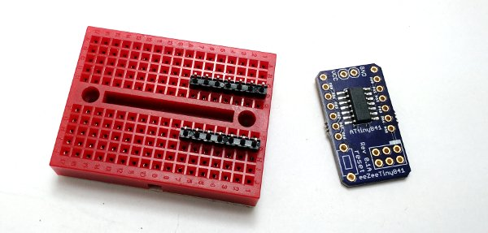
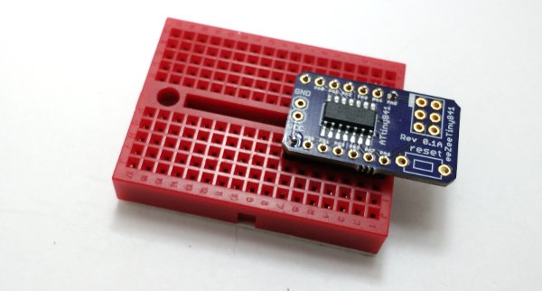
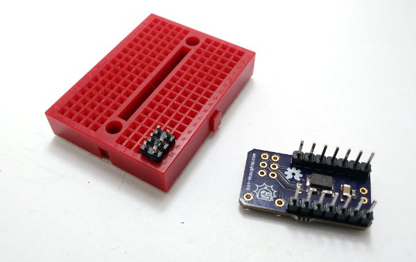
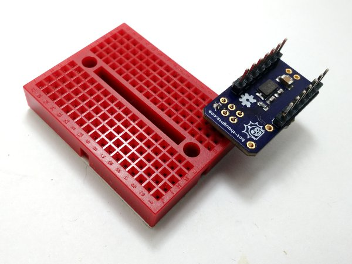
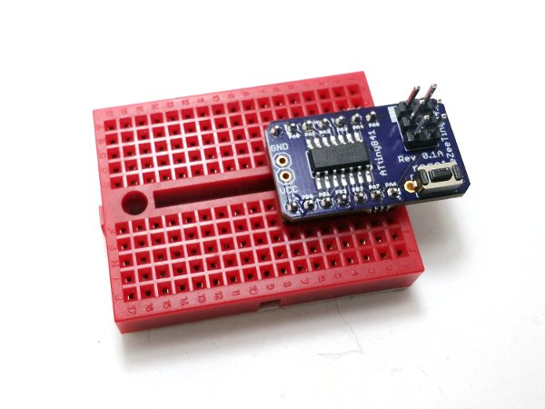

# Assembling Your Board

Assembly is easy. And, you can learn how to solder at the same time. Review [Sparkfun's Soldering Tutorial](https://learn.sparkfun.com/tutorials/how-to-solder---through-hole-soldering) if you need to. Here's a helpful info-graphic from the tutorial:

### You'll need
* Soldering iron, 40W
* Sponge to clean the iron (I recommend a brass sponge)
* Workbench with plenty of light
* Ventilation since breathing flux fumes is irritating
* Soldering surface (e.g., marble tile sample)
* Rosin core solder 0.022” or 0.032” diameter
* Kester #2331-ZX flux pen (optional)

### Pin Headers

* Insert thttps://github.com/shimniok/eeZeeTiny841/tree

* Place the eeZeeTiny841 on top of the pin headers. MCU side up.
* Hold board down while soldering one pin in each rows

* Solder the remaining pin headers in place.

### AVR ISP Header

* Insert the 2x3 AVR ISP header into the breadboard, short pins up.

* Place the eeZeeTiny841 board onto the 2x3 header
* Holding the board in place, solder one pin.

* Check vertical alignment of the ISP header and adjust by melting the solder joint, if necessary.
* Solder the remaining 5 pins.

### Reset Switch

* Insert the board into the breadboard right side up.
* Install the switch and bend the pins if necessary to hold it in place.

* Solder the switch from the top
* Remove the board and solder the pins from the bottom

### Power (optional)

* Install the 2-pin header into the breadboard, short side up
* Place the eeZeeTiny841 onto the pin header so the header sticks up on the MCU side
* Hold the board in place and solder one pin
* Check vertical alignment of the header and adjust by re-melting the solder joint.
* Solder the remaining pin.

### Cleanup

You'll want to remove the rosin and flux

I usually just use isopropyl alcohol and an old toothbrush

You can also buy chemicals specifically for removing flux and rosin

[Return to README](README.md)
