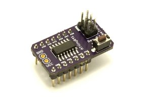
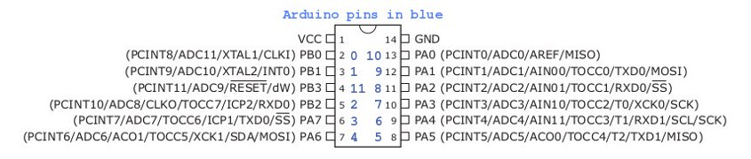

# eeZeeTiny841 User Guide



## Introduction

The new, powerful ATtiny841 features 14 pins, two USARTs, SPI, I2C slave, three timers, ADC and more. The eeZeeTiny841 board exposes all pins and adds a reset circuit, AVR ISP programming interface, bypass capacitors, and optional crystal: all in a compact breadboard-friendly form factor.

Want one? [Buy now on Tindie](https://www.tindie.com/products/bot_thoughts/eezeetiny841/).

### Pinout



## How to Assemble

Assembly is easy. And, you can learn how to solder at the same time. Review [Sparkfun's Soldering Tutorial](https://learn.sparkfun.com/tutorials/how-to-solder---through-hole-soldering) if you need to. Here's a helpful info-graphic from the tutorial:


### You'll need
* Soldering iron, 40W
* Sponge to clean the iron (I recommend a brass sponge)
* Workbench with plenty of light
* Ventilation since breathing flux fumes is irritating
* Soldering surface (e.g., marble tile sample)
* Rosin core solder 0.022” or 0.032” diameter
* Kester #2331-ZX flux pen (optional)

### Pin Headers

* Insert the two 7-pin headers on a breadboard, spaced 5 rows apart, short side of the pins facing up.
* Place the eeZeeTiny841 on top of the pin headers. MCU side up.
* Solder the pin headers in place.

### AVR ISP Header

* Insert the 2x3 AVR ISP header into the breadboard, short pins up.
* Place the eeZeeTiny841 board onto the 2x3 header
* Holding the board in place, solder one pin.
* Check vertical alignment of the ISP header and adjust by melting the solder joint, if necessary.
* Solder the remaining 5 pins.

### Reset Switch

* Remove the eeZeeProp from the breadboard.
* Install the switch and bend the pins if necessary to hold it in place.
* Solder the switch from the bottom and then, optionally, from the top.

### Power (optional)

* Install the 2-pin header into the breadboard, short side up
* Place the eeZeeTiny841 onto the pin header so the header sticks up on the MCU side
* Hold the board in place and solder one pin
* Check vertical alignment of the ISP header and adjust by melting the solder joint, if necessary.
* Solder the remaining pin.

## Getting Started

### IDE

To write code for ATtiny, you can use the following IDEs:

  * [AVR Studio](http://www.atmel.com/tools/STUDIOARCHIVE.aspx)
  * [Atmel Studio](http://www.atmel.com/microsite/atmel_studio6/)
  * Eclipse and the [AVR Plugin](http://avr-eclipse.sourceforge.net/wiki/index.php/The_AVR_Eclipse_Plugin)
  * Arduino IDE? Not yet. I'm porting [arduino-tiny core](https://github.com/shimniok/arduino-tiny). Want to help?

### Toolchain

  * Install  [ATmel AVR Toolchain](http://www.atmel.com/products/microcontrollers/avr/tinyAVR.aspx?tab=tools) for either Windows or Linux.
  * Install the latest avrdude.
  * As of Nov 26, 2014, you must still add the contents of [add\_to\_avrdude.conf](https://bot-thoughts-eezee.googlecode.com/svn/trunk/eeZeeTiny841/setup/add_to_avrdude.conf) to your avrdude.conf.

### Programmer

I use and recommend the following programmers:

  * [pololu.com Pololu AVR Programmer](http://www.pololu.com/product/1300). Follow the instructions in the [User's Guide pdf](http://www.pololu.com/docs/0J36)
  * AVR Dragon

You can also use an AVRISP MkII, your Arduino ([here's how](http://arduino.cc/en/Tutorial/ArduinoISP)), or other AVR ISP compatible hardware.

### ISP Header

When it's time to plug in the eeZee Tiny board, locate the white rectangle next to the ISP header which marks pin 1.


### Example Code

You can find example code in [examples](https://github.com/shimniok/eeZeeTiny841/tree/master/examples)

This example implements a Larson scanner, individually turning on pins PA0-7, PB0-2. Connect LEDs and enjoy the light show. Source: [larson.c](https://github.com/shimniok/eeZeeTiny841/tree/master/examples/larson/larson.c). Binary: [larson.hex](https://github.com/shimniok/eeZeeTiny841/tree/master/examples/larson/larson.hex)

```
/** ATtiny841 test
 *
 * Author: Michael Shimniok (www.bot-thoughts.com)
 * Description: Sequentially turns on a single pin on PA0-7 and PB0-2 (PB3 is reset)
 *
 */
#include <avr/io.h>
#include <avr/interrupt.h>
#include <util/delay.h>

int main()
{
  char i;

  PORTA=0;
  PORTB=0;
  DDRA=0xff;   // All PORTA as output
  DDRB=0x07;   // PB0-2, PB3 is reset

  while (1) {
    for (i = 0 ; i < 8; i++) {
      PORTA = (1 << i);
      _delay_ms(300);
    }
    PORTA = 0;

    for (i = 2; i < 3; i++) {
      PORTB = (1 << i);
      _delay_ms(300);
    }
    PORTB = 0;
  }

}
```

# Operating Conditions #

Please use your ATtiny breakout boards with regulated supplies of 5V or less, with minimal ripple, at temperatures around 25C (77F). Do not use the boards in high temperature conditions.

# Source #
  * [source](https://code.google.com/p/bot-thoughts-eezee/source/browse/#svn%2Ftrunk%2FeeZeeTiny841)
  * [electronics](https://code.google.com/p/bot-thoughts-eezee/source/browse/#svn%2Ftrunk%2FeeZeeTiny841%2Felectronics)
  * [firmware demos](https://code.google.com/p/bot-thoughts-eezee/source/browse/#svn%2Ftrunk%2FeeZeeTiny841%2Ffirmware)
